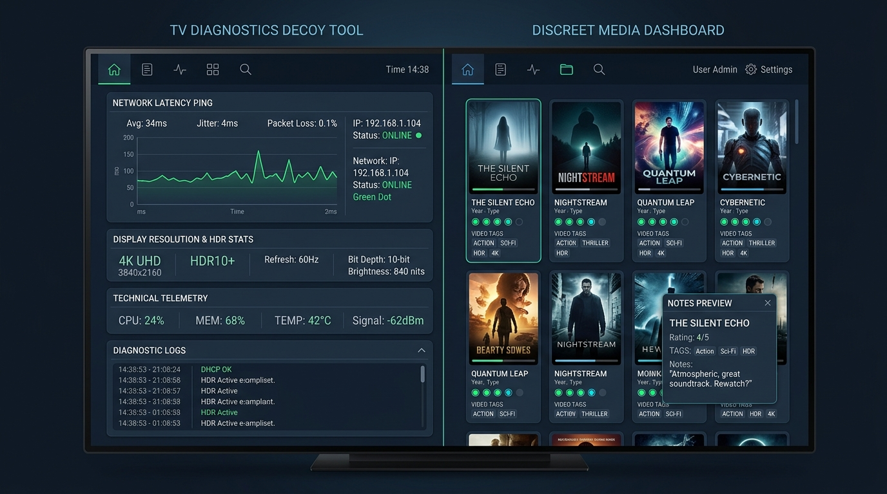

# TV Diagnostics Descrete Video backend+App



A discreet, privacy-first media streaming platform tailored for TVs running Android (Google TV, Android TV, Amazon Fire TV, and generic Android TV boxes). 

The platform consists of:
1. **Docker Compose Backend**: A lightweight, fast media server that indexes mounted host video folders, extracts metadata, generates preview thumbnails at **60 seconds**, supports **Direct Play HTTP Byte-Range streaming**, manages video notes, video **tags**, discreet circle ratings (`○`, `●`, `●●`), and tracks playback progress with backend reset capabilities. Features a responsive desktop admin console with **60% compact cards**, 2-line clamped notes previews with a modal editor, dynamic tag filtering, and instant automatic database backups on metadata edits with smart file relocation tracking.
2. **Android TV Client APK**: An app camouflaged as **"TV Diagnostics"** featuring a functional display & network telemetry diagnostic suite, unlocked via a **6-digit numeric PIN**, complete with **Media3 ExoPlayer direct playback**, D-pad remote optimization, symbol-only circle ratings, remote search & tag filtering, a **4-digit PIN-protected Notes display toggle** (`NOTES_PIN`), and **Inactivity Auto-Lock** (15-min pause / 5-min ended timeout). Also includes an instant **Panic Shield** (`Double-tap BACK` or `MENU`).

---

## Architecture Overview

```
                          Local Network (Wi-Fi / Ethernet)
[ Host Video Folders ] ──> [ Docker Backend (:8090) ] <─── [ Android TV Client APK ]
  (/media/videos:ro)         - 60s Thumbnail Gen             - Decoy: TV Diagnostics
                             - ffprobe Metadata              - Secret 6-Digit PIN (Vault Unlock)
                             - HTTP 206 Direct Play          - Secret 4-Digit PIN (Notes Unlock)
                             - Tags, Notes, Circle Ratings   - Discreet Ratings (○, ●, ●●)
                             - Compact Cards & Edit Modal    - Remote D-pad Search & Tag Chips
                             - Playback Reset Action         - Media3 ExoPlayer Direct Play
                             - SMB Delayed Mount Watcher     - Panic Shield (Double BACK / MENU)
```

---

## Part 1: Standalone Docker Compose Backend Setup

The backend is published as a pre-built container image on **GitHub Container Registry (GHCR)**: `ghcr.io/uri-travoski/tv-diagnostics-backend:latest`. You can run it completely standalone without building from source.

### 1. Download or Configure `docker-compose.yml`
Save the following `docker-compose.yml`:

```yaml
services:
  tv-diagnostics-backend:
    image: ghcr.io/uri-travoski/tv-diagnostics-backend:latest
    container_name: tv-diagnostics-backend
    restart: unless-stopped
    ports:
      - "8090:8090"
    environment:
      - PIN_CODE=123456            # Secret 6-digit numeric PIN for TV Vault unlock
      - NOTES_PIN=1234             # Secret 4-digit numeric PIN for TV Notes toggle unlock
      - PORT=8090
      - SCAN_ON_STARTUP=true
      - SCAN_INTERVAL_MINUTES=30
      - MOUNT_POLL_INTERVAL_SECONDS=5 # Polling interval while waiting for SMB mount
      - VIDEO_DIRS=/videos
    volumes:
      # Mount your host/SMB video folder here (read-only recommended)
      - /mnt/storage/my_videos:/videos:ro
      
      # Persistent database, rolling backups, and generated 60s thumbnails
      - ./data:/app/data
```

### 2. Start the Backend
```bash
docker compose up -d
```

The backend server is now running on `http://<your-server-ip>:8090`.

---

## Part 2: Backend Features & Web Management Portal

### Discreet Root Landing Page (`http://<server-ip>:8090/`)
Anyone attempting to browse to the server root URL sees a generic **TV Diagnostic Probe / Network Node** status screen. Entering the 6-digit PIN unlocks the admin console.

### Desktop Admin Console (`http://<server-ip>:8090/admin`)
Accessing `/admin` provides a clean desktop interface:
- **60% Compact Cards**: Space-efficient card grid optimized for desktop displays.
- **60-Second Thumbnails**: View automatically generated snapshots captured at 60s into each video.
- **Discreet Circle Ratings**: Symbol-only rating buttons cycling between:
  - `○` : Unrated
  - `●` : Level 1
  - `●●` : Level 2
- **Video Tags**: Assign tags to any video (e.g. `nature, 4k, vacation`). Filter videos instantly via the tag dropdown or clickable tag chips.
- **Clamped Notes Preview & Edit Modal**: Notes are clamped to 2 lines on the card with an ellipsis. Clicking the notes text or the "✎ Edit" button opens an **Edit Video Modal** allowing easy editing of full notes, tags, and ratings.
- **Playback Tracking & Reset**:
  - View watched percentage and timestamps for every video.
  - Click **"↺ Reset"** on any video to restore playback position back to `0:00`.
  - Click **"Reset All Progress"** to reset all videos in one click.
- **Direct Preview**: Test playback directly in the browser via HTML5 video.
- **Rescan Media**: Click **"↻ Rescan Media"** to scan newly added files.

---

## Part 3: Android TV Client APK ("TV Diagnostics")

### 1. Pre-built APK Location
The compiled debug APK is ready for installation:
```
tv-client/dist/tv-diagnostics.apk
```

### 2. Sideloading onto Your TV
The APK is compatible with **all Android TVs, Google TVs, and Fire TV devices**:
- **Option A (ADB)**:
  ```bash
  adb connect <tv-ip-address>
  adb install tv-client/dist/tv-diagnostics.apk
  ```
- **Option B (Downloader App / USB)**:
  Copy `tv-diagnostics.apk` onto a USB drive or host it on your local network, then install it using the **Downloader** app on Fire TV or a file manager on Android TV.

### 3. Rebuilding the APK
To rebuild the APK from source:
```bash
cd tv-client
./gradlew assembleDebug
```
Output: `tv-client/app/build/outputs/apk/debug/app-debug.apk`.

---

## Part 4: Using the TV App (Remote Control & Stealth)

### 1. Decoy Diagnostics Mode
When opened on the TV, the app appears as **"TV Diagnostics"** with a generic circuit/probe banner. It provides real diagnostic utilities:
- **Display Capabilities**: Resolution (e.g. 1920x1080 / 3840x2160) and panel refresh rate (60Hz / 120Hz).
- **Network Health**: Displays device IP, gateway, and live ICMP ping test with latency display.
- **Screen / Dead Pixel Test**: Cycles through solid black, white, red, green, and blue panels to check for defective pixels.

### 2. Unlocking the Vault (6-Digit PIN)
To access the private media collection:
- **Method 1**: Click the **"Server Diagnostic Code"** button on the main menu, and enter your **6-digit numeric PIN** (default: `123456`) using the D-pad keypad or remote numeric keys (0–9).
- **Method 2**: On any diagnostics screen, input the remote sequence:
  `[UP] -> [UP] -> [DOWN] -> [DOWN] -> [LEFT] -> [RIGHT]`.

### 3. Notes Security Toggle (4-Digit PIN)
- Under **Settings / Connection & Options** (in Decoy mode or Vault top bar), the user can view the **Video Notes Feature** status.
- **Default State**: Notes are **OFF / Hidden** by default in the TV app.
- **Enabling Notes**: Clicking "Enable Notes" displays a 4-digit PIN dialog. Entering the 4-digit PIN (default: `1234`, set in `docker-compose.yml`) unlocks the notes feature.
- **Disabling Notes**: Clicking "Disable Notes" immediately hides notes again without requiring a PIN.

### 4. Vault Media Browser
- **Leanback Grid**: Fully optimized for TV remote D-pads with high-visibility glowing focus indicators.
- **Symbol-Only Ratings**: Filters and video cards display strictly circle symbols (`○`, `●`, `●●`) with no descriptive text.
- **Remote Search Bar**: D-pad focusable search input to filter videos by title, filename, tags, or notes.
- **Horizontal Tag Chips**: Horizontally scrolling tag bar allowing 1-click filtering by any backend tag.
- **Video Detail Modal**: Displays duration, resolution badge, tags, and (if unlocked) custom notes. Offers **"Resume from MM:SS"**, **"Play from Beginning"**, and **"Reset Playback"**.

### 5. Direct Play Video Player (Media3 ExoPlayer)
- **High-Performance Direct Play**: Uses native TV hardware decoders (`MediaCodec`) via HTTP 206 byte ranges for instant seeking with zero buffering lag.
- **TV Remote Navigation**:
  - `[OK / DPAD CENTER]`: Play / Pause toggle.
  - `[LEFT / RIGHT]`: Fast seek backward/forward 10 seconds.
  - `[UP / DOWN]`: Toggle player control overlay and timeline.
- **Auto-Sync Heartbeat**: Syncs watch progress to the backend every 10 seconds and saves exact timestamp on exit.
- **PANIC SHIELD**: 
  - **Double-press `[BACK]`** or press **`[MENU]`** at any point during playback.
  - Playback terminates instantly, audio focus is dropped, task backstack is wiped, and the TV screen immediately reverts to a blank black display panel test.
  - Android `FLAG_SECURE` is active throughout, ensuring no video frame thumbnails ever appear in the Android TV "Recent Apps" switcher.

---

## Part 5: Verification & API Testing

An automated test suite is included in `backend/test_backend.py`:

```bash
python3 backend/test_backend.py
```

Endpoints and capabilities verified:
- `/api/v1/status` (Health, SMB mount readiness, video counts)
- `/api/v1/auth/verify` (6-digit PIN vault verification)
- `/api/v1/auth/verify-notes-pin` (4-digit notes PIN verification)
- `/api/v1/videos` & `/api/v1/videos?tag=...` (Video list & tag filtering)
- `/api/v1/videos/{id}/stream` (HTTP 206 Direct Play byte ranges)
- `/api/v1/videos/{id}/thumbnail` (60-second auto-thumbnail)
- `/api/v1/videos/{id}/metadata` (Circle ratings, notes, tags update)
- `/api/v1/tags` (Dynamic tag counts and extraction)
- `/api/v1/videos/{id}/progress` & `reset-progress` (Resume position tracking & reset)
